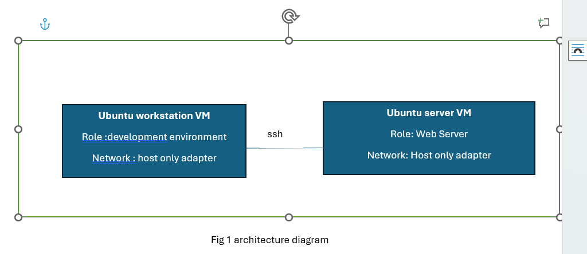
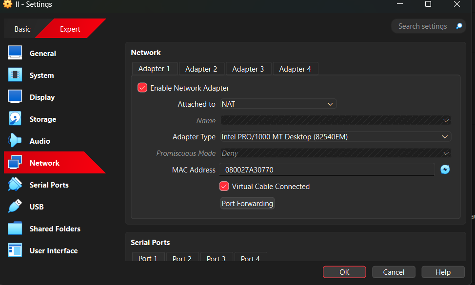
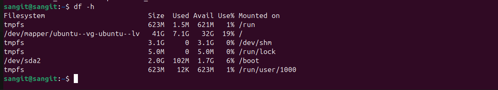
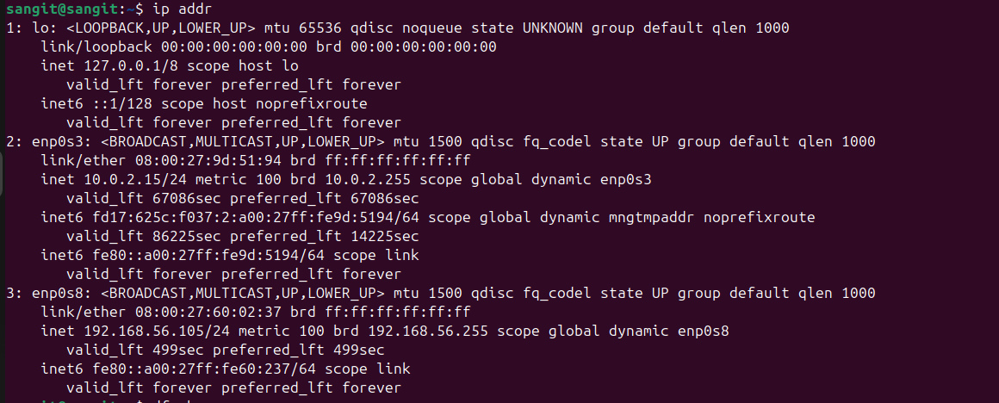

# Phase 1: System Planning and Distribution Selection

## 1. System Architecture Diagram
This system diagram illustrates network connections between Ubuntu Server and Ubuntu Workstation. These attributes are running inside the virtual box as a virtual machine, enabling remote access and management.

**Fig 1: Architecture diagram**

- **Ubuntu server**: A server that provides necessary services like SSH, web server, and databases.
- **Ubuntu workstation**: A graphical workstation used for development and interaction with the server.
- **Network Connection**: SSH is used for a network connection between server and workstation.

## 2. Distribution Selection and Comparison
I have chosen Ubuntu server and Ubuntu workstation, as it is known for being easy to use, supports various applications for development, and is known for its high performance and wide user support.

- **Ubuntu server** uses `apt` for package management, which resolves any package-related issues and also supports broken packages.
- Ubuntu supports various types of applications for development and allows third-party applications to be installed.
- Ubuntu is best for beginners because it provides a user-friendly environment and is easy to use.
- Ubuntu provides a variety of support through online forums. [1]

### Comparison between Ubuntu and Other Distributions

| Feature              | Ubuntu Server | CentOS         | Red Hat         |
|----------------------|---------------|----------------|-----------------|
| Package Management   | Apt (widely used)  | Yum/DNF        | Yum             |
| Security             | AppArmor, UFW | SELinux        | SELinux, Firewalld |
| Stability            | Stable with LTS release | CentOS Stream | Very Stable     |
| Setup                | Excellent, easy to setup | Requires more configuration | More complex than others |

## 3. Workstation Configuration
I have chosen the Ubuntu Desktop because it is easy to use and best for beginners, providing a graphical environment for users. It is an open-source Debian-based Linux distribution.

### Key Reasons:
- Users can adjust the RAM, storage (which takes less storage), and CPU (2 CPU cores) for the Ubuntu Desktop, making it capable of handling development and network management tasks.
- Ubuntu provides services that support a variety of development applications and it is easy to install applications using `apt`.
- Ubuntu Desktop provides a graphical interface, making it easier to interact with the system.
- Ubuntu uses security features like AppArmor for application layers and `ufw` for a simple firewall, which adds a protection layer to the system—useful for a development environment.

Compared to other desktop workstations like Linux Mint, Ubuntu is more oriented toward professional development environments, while Mint is more for casual users. Fedora is great for users who want the latest software, but Ubuntu is easier to use and has more community support.

## 4. Network Configuration
This section explains in detail how the Ubuntu Server and Ubuntu Desktop are connected, running inside VirtualBox by outlining VirtualBox network settings and IP addresses.

### Network Connection in VirtualBox:
- **NAT (Network Address Translation)**
- **Host-only Adapter**

### Network Interface Inside VirtualBox:
This is the network connection of the Ubuntu Workstation, which is attached to NAT, connecting the VM to the outside world. It allows the guest to browse the web and download packages. For the adapter, `Intel PRO/1000MT Desktop (82540EM)` is used, with the MAC address `080027A30770`. Ubuntu Server and Workstation are connected via SSH.

The network connection of the Ubuntu Server inside the virtual machine is as follows:
- **Adapter 1**: Uses Host-only Adapter
  - Attached to: Host-only adapter
  - Purpose: Used for internal communication between host and server for secure SSH access.

This configuration is ideal for a simulated development or testing environment where the Workstation needs external connectivity, but the Server requires protected, controlled access, primarily from the administrator (the Host) and the client (the Workstation).

### IP Address of Workstation and Server
- **Uname**: Displays basic information about the operating system.
- **Free**: Displays basic information about how much RAM is used and free in the operating system.
- **Df -h**: Displays basic information about how much disk space is used and free in the operating system.
  
- **Ip a**: Displays basic information about the network interface, like `enp0s3` and its IP address.
  
- **Lsb_release -a**: Displays basic information about the distributor and version.
