#  Performance Testing Plan: Ubuntu Implementation

The Ubuntu Workstation will host the load generation tool, while the Ubuntu Server will host the application being tested and the monitoring utilities.

## A. Ubuntu Server (Target/SUT) Monitoring Methodology

You will use built-in or easily installed command-line utilities for detailed remote monitoring during the tests.

| Metric Area            | Tool/Command                          | Installation                          | Key Metrics/Output                                                       |
|------------------------|---------------------------------------|---------------------------------------|---------------------------------------------------------------------------|
| Overall System         | `htop` or `top`                       | `sudo apt install htop` (if not present) | Real-time CPU usage, Memory/Swap usage, and a list of running processes. |
| Detailed CPU/Memory    | `atop`                                | `sudo apt install atop`               | Advanced monitoring, including historical logging and resource saturation indicators (color-coded output). |
| Disk I/O               | `iostat`                              | Part of `sysstat`: `sudo apt install sysstat` | I/O rates, latency (await), and disk utilization (%util). |
| Network Traffic        | `iftop` or `nmon`                     | `sudo apt install iftop nmon`         | Real-time bandwidth usage per interface and per connection. `nmon` is an all-in-one monitor. |
| Process-Specific I/O   | `iotop`                               | `sudo apt install iotop`              | Displays I/O usage by individual processes, crucial for finding data access bottlenecks. |
| Database (e.g., MySQL) | `mysqltop` or Percona Toolkit         | `sudo apt install mytop` (or equivalent) | Query execution times, connection counts, and lock contention. |

---

## Testing Approach

- **htop**: Real-time CPU usage, Memory/Swap usage, and a list of running processes.
  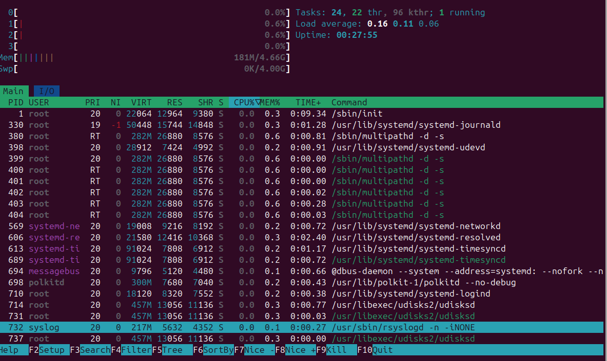
- **iostat**: I/O rates, latency (await), and disk utilization (%util).
   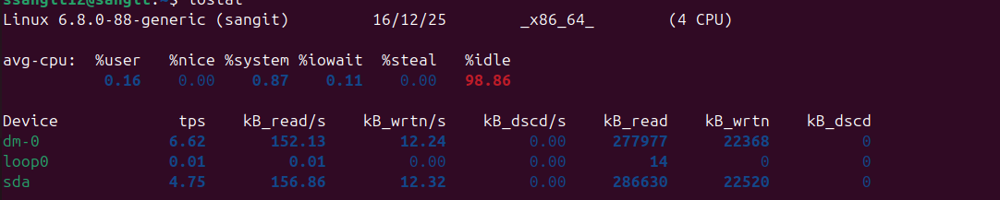
- **nmon**: Real-time bandwidth usage per interface and per connection.
   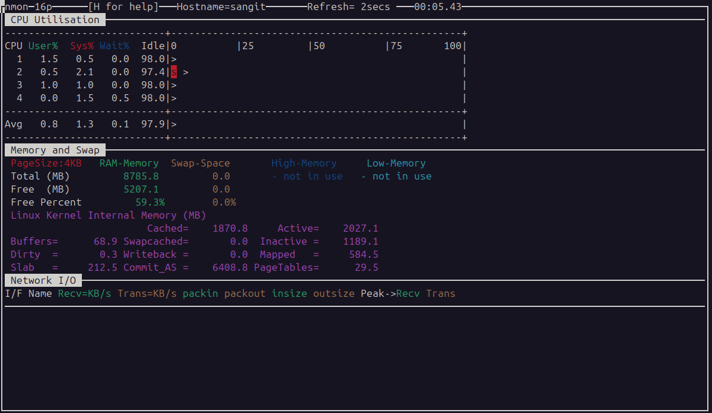
- **atop**: Advanced monitoring with historical logging.
   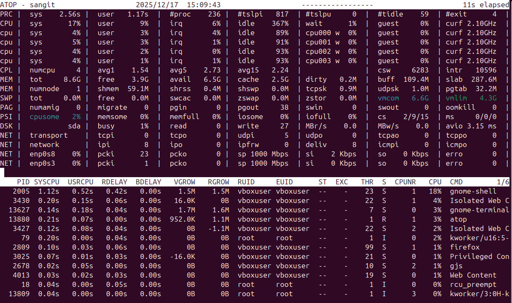
 - ps tree:
    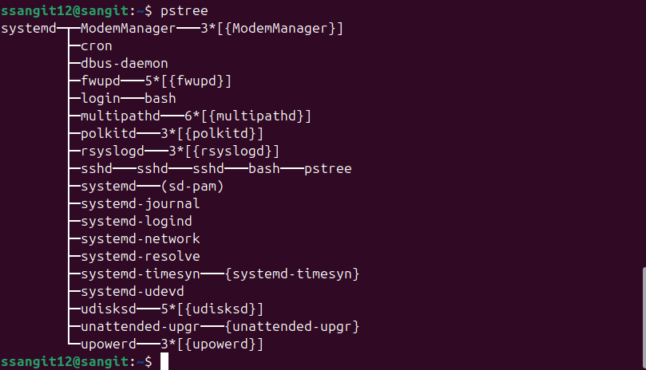
---

#  Security Configuration Checklist for Ubuntu

This list focuses on hardening your Ubuntu Server, which is exposed to the network. The Workstation should also follow these steps for user privilege management.

| Area                    | Checklist Item                          | Ubuntu Command/Configuration File                        |
|-------------------------|-----------------------------------------|----------------------------------------------------------|
| **SSH Hardening**        | Disable Root Login                      | Set `PermitRootLogin no` in `/etc/ssh/sshd_config`.       |
|                         | Use Key-Based Auth Only                 | Set `PasswordAuthentication no` in `/etc/ssh/sshd_config`.|
|                         | Change Default Port                     | Set `Port [New Port Number]` (e.g., 2222) in `/etc/ssh/sshd_config`. Must restart SSH service: `sudo systemctl restart ssh`. |
| **Firewall (UFW)**       | Default Deny Policy                     | UFW defaults to deny; ensure you enable it with: `sudo ufw enable`. |
|                         | Allow Only Required Ports               | `sudo ufw allow [New SSH Port]`, `sudo ufw allow http`, `sudo ufw allow https` (80/443). |
|                         | Install Intrusion Prevention            | `sudo apt install fail2ban`.                              |
| **Mandatory Access Control (MAC)** | Enable AppArmor                     | `sudo systemctl status apparmor`                          |
|                         | Restrict Unprivileged User             | Apply stricter controls to unprivileged user namespaces via `sysctl` for modern Ubuntu versions. |
| **Automatic Updates**    | Enable Unattended Upgrades              | `sudo apt install unattended-upgrades` and ensure configuration files in `/etc/apt/apt.conf.d/` are set to automatically install security updates. |
| **User Privilege Mgmt**  | Disable Root Access                     | Do not use the root user for daily tasks. Create a standard user: `sudo adduser [username]`. |
|                         | Use sudo for Admin Tasks                | Add your user to the sudo group: `sudo usermod -aG sudo [username]`. |
|                         | Strong Password Policy                  | Enforce minimum length and complexity using the `pam_pwquality` module configuration (e.g., `/etc/security/pwquality.conf`). |

---
## Testing approach
- ssh hardening by key generate and key absed auth only.
  

  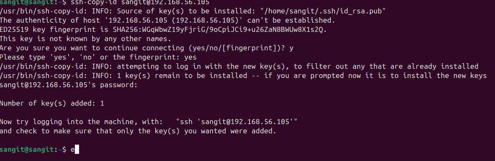

  -firewall :
   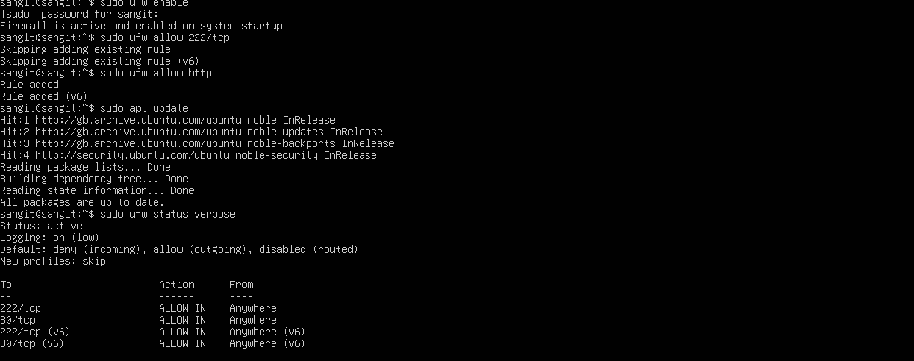

  -MAC(Mandatory Access Control):
  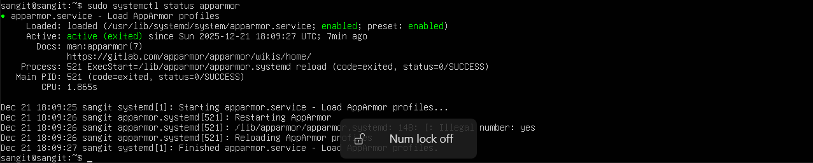

  - User Privilege:
    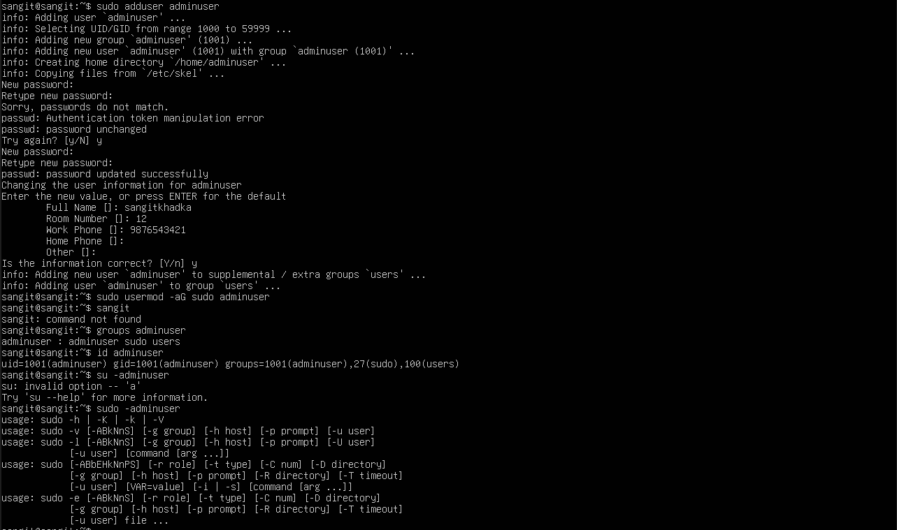

    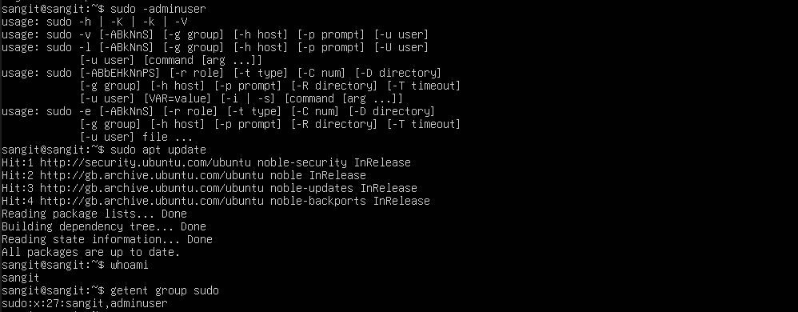

#  Threat Model (Ubuntu-Specific Threats)

| Threat                              | Description                                                     | STRIDE Category                | Ubuntu Mitigation Command/Action                                           |
|-------------------------------------|-----------------------------------------------------------------|--------------------------------|--------------------------------------------------------------------------|
| **Unpatched Kernel/OS**            | Exploiting a publicly known vulnerability (CVE) in an outdated Linux kernel or system library. | Denial of Service, Elevation of Privilege | Automate Updates: Ensure unattended-upgrades is running and functional. Action: `sudo apt update && sudo apt upgrade -y`. |
| **Local Privilege Escalation**     | A low-privileged user or compromised application exploits a system weakness to gain root access. | Elevation of Privilege         | MAC (AppArmor): Ensure critical application processes are confined by an AppArmor profile. Action: `sudo aa-enforce /etc/apparmor.d/[profile]`. |
| **Exposed Internal Services**      | An attacker scans the server and finds an open service (e.g., an internal database port, or an exposed monitoring tool) not meant for public access. | Information Disclosure, Spoofing | Restrict UFW: Only expose ports required for the application. Action: `sudo ufw deny from any to any port [Internal Port]` (e.g., 5432 for Postgres). |

---

Unpatch :
 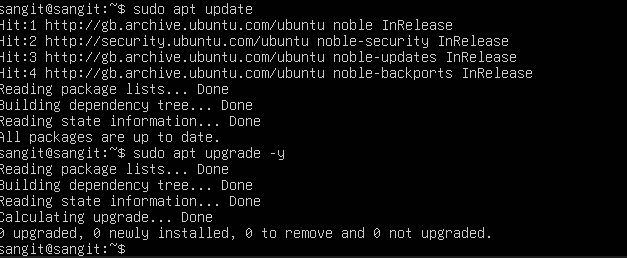

 Internal Service :
  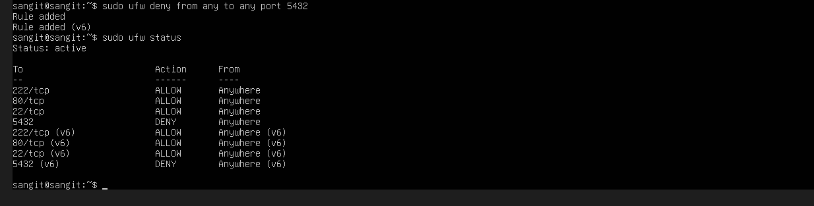
 

## What I Have Learned

### 1. Systematic Performance Monitoring
I learned that "performance" is multi-dimensional. Using a single tool isn't enough; you need a specialized toolkit to see the full picture:
- **htop / atop**: Taught me how to identify CPU spikes and memory leaks.
- **iostat / iotop**: Showed me that "slowness" is often caused by disk bottlenecks (I/O wait), not just the processor.
- **nmon**: Provided a holistic view of how data moves across the network interfaces.

### 2. Infrastructure Hardening
I learned that the default configuration of a server is rarely secure enough for production. My key takeaways included:
- **SSH Security**: Moving from passwords to Public Key Authentication (`PubkeyAuthentication yes`) is the single most effective way to stop brute-force attacks.
- **Firewall Logic**: Implementing a "Default Deny" policy with UFW ensures that only the doors I intentionally open are available to the public.

### 3. Proactive Threat Mitigation
By using the STRIDE model, I learned to categorize risks rather than just reacting to them:
- **AppArmor**: I now understand how Mandatory Access Control (MAC) limits the "blast radius" of a compromised application.
- **Unattended Upgrades**: I learned that automation is a security feature; keeping the kernel patched automatically is the best defense against known vulnerabilities (CVEs).

## CLI Comments:
-ls_l
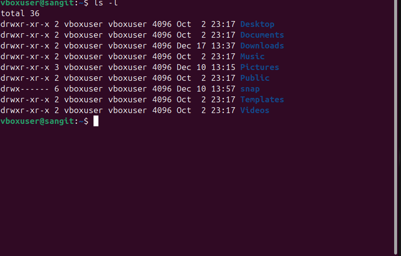

-pwd
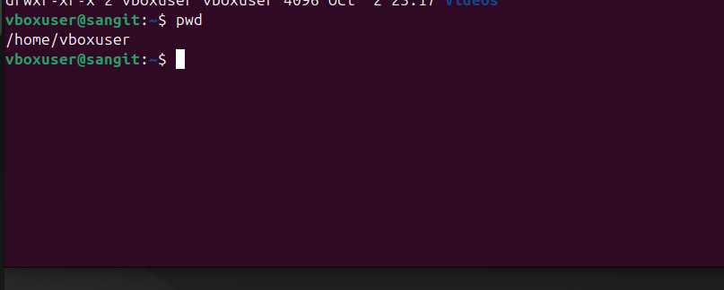

-help
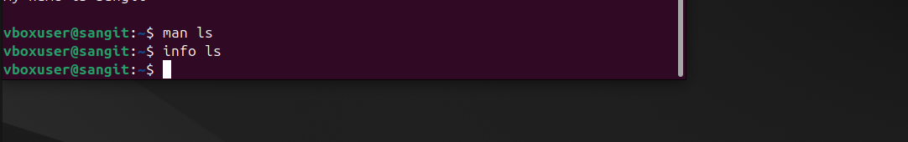

-file manuplation:

-fileview
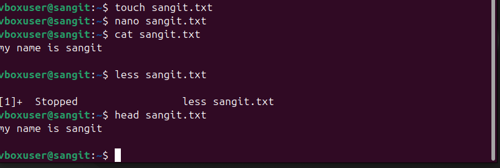
