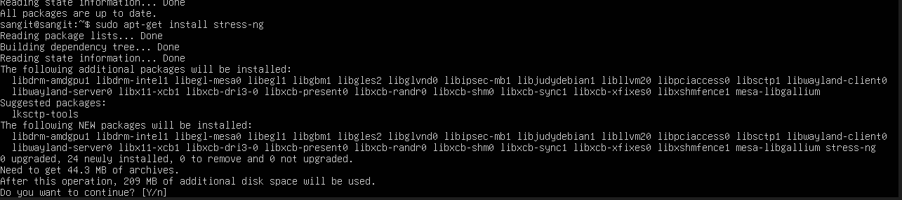
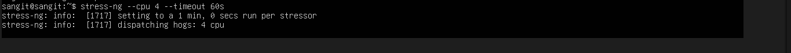
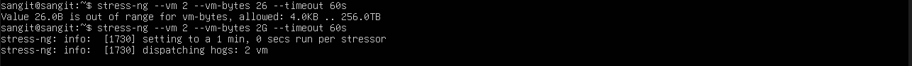
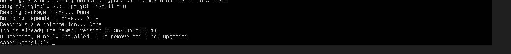
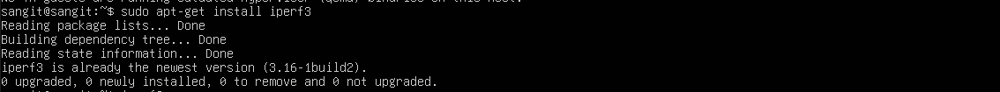
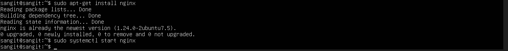
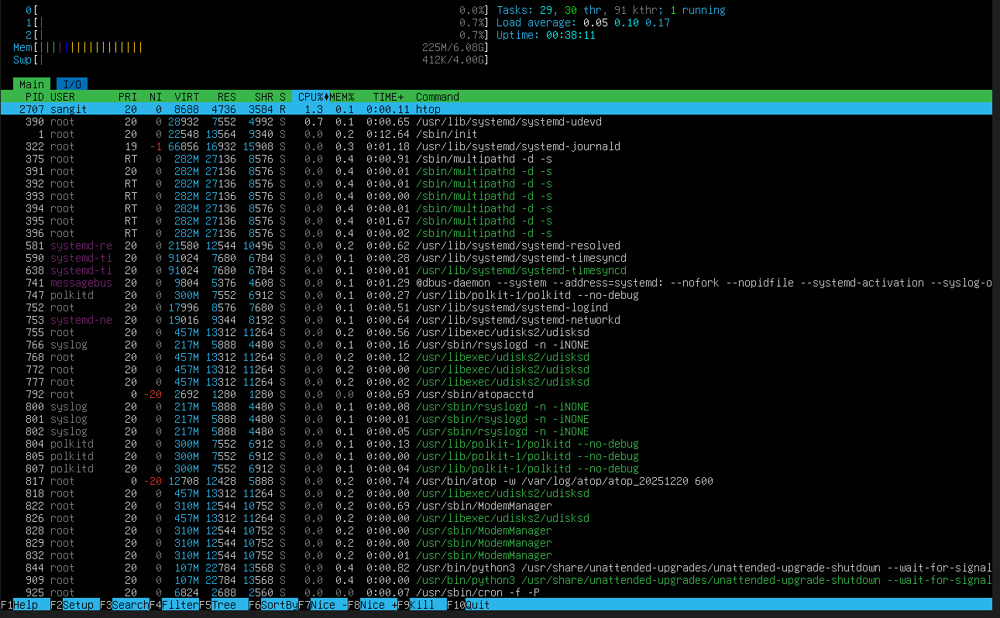
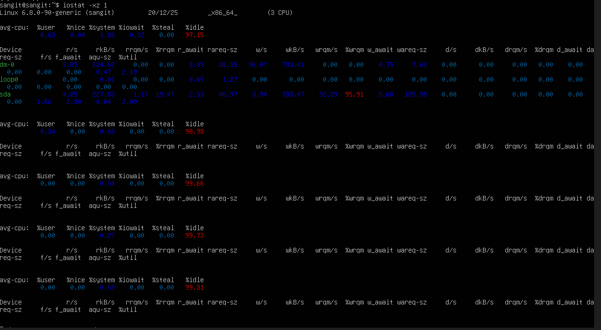
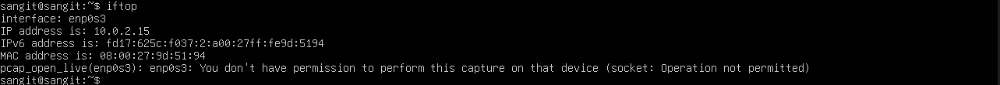

# Phase 3: Application Selection for Performance Testing

## 1. Application Selection Matrix

In this phase, the goal is to select applications that represent different workload types for performance evaluation. Below is the **Application Selection Matrix** with justifications for choosing each application.

| **Workload Type** | **Application** | **Justification** |
| --- | --- | --- |
| **CPU-intensive** | **stress-ng** | Simulates high CPU loads to test performance under stress. |
| **RAM-intensive** | **stress-ng** | Allocates large memory amounts to test RAM usage under heavy load. |
| **I/O-intensive** | **fio** | Tests disk I/O performance with flexible benchmarking tools. |
| **Network-intensive** | **iperf3** | Measures network bandwidth and latency for network testing. |
| **Server Application** | **nginx** | A popular web server used to test server load by handling many simultaneous connections. |

## 2. Installation Documentation

The following installation steps outline how to install each selected application for testing. 
 ### For stress-ng (CPU and RAM-intensive)

- Update system packages
- sudo apt-get update
- Install stress-ng
- sudo apt-get install stress-ng

 - Run stress-ng for CPU stress testing

-  stress-ng --cpu 4 --timeout 60s

-  Run stress-ng for RAM stress testing
- stress-ng --vm 2 --vm-bytes 2G --timeout 60s
  

### For fio (I/O-intensive)

- Update system packages
- sudo apt-get update
- install fio
- sudo apt-get install fio
  

### For iperf3 (Network-intensive)

- Update system packages
- sudo apt-get update
- nstall iperf3
- sudo apt-get install iperf3
   
  

### For nginx (Server Application)**

- Update system packages
- sudo apt-get update
- Install nginx
- sudo apt-get install nginx
- Start nginx server
- sudo systemctl start nginx
  

## 3. Expected Resource Profiles

Below are the expected resource profiles for each application, based on anticipated resource usage during the tests:

| **Application** | **CPU Usage** | **Memory Usage** | **Disk I/O** | **Network Usage** |
| --- | --- | --- | --- | --- |
| **stress-ng (CPU)** | Very High (during stress) | Low to Medium (minimal memory required) | Low (no disk usage) | Low (no network usage) |
| **stress-ng (RAM)** | Low (CPU usage stays low) | Very High (allocates large memory) | Low (no disk usage) | Low (no network usage) |
| **fio** | Low to Medium | Medium (depends on test size) | Very High (for disk read/write) | Low (minimal network usage) |
| **iperf3** | Low (network testing) | Low (minimal memory) | Low (no disk usage) | Very High (network throughput) |
| **nginx** | Medium | Low (memory usage for serving static files) | Low (serving static content) | High (due to many connections) |

## 4. Monitoring Strategy

To measure performance, the following tools and commands will be used to monitor CPU, RAM, I/O, and network usage during the tests.

## CPU Usage Monitoring**

**Tool**: top, htop

**Command**: top or htop

## Memory Usage Monitoring

**Tool**: free -m, vmstat

## Disk I/O Monitoring

- **Tool**: iostat

**Command**:  iostat -xz 1 

## Network Usage Monitoring**

- **Tool**: iftop, netstat
   
**Command**:  iftop

## 5. Conclusion

The selected applications represent a broad range of workloads across CPU, RAM, I/O, network, and server application types. Using these applications will help simulate real-world conditions and evaluate the performance of a system under stress. Each tool is installed and monitored using standard system performance monitoring utilities to track CPU, memory, disk I/O, and network usage.

This journal provides a structured approach for performance testing and monitoring, ensuring that each workload type is adequately tested.
