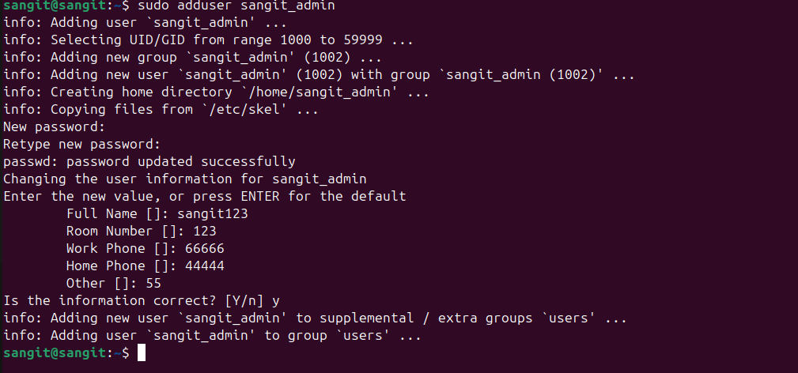
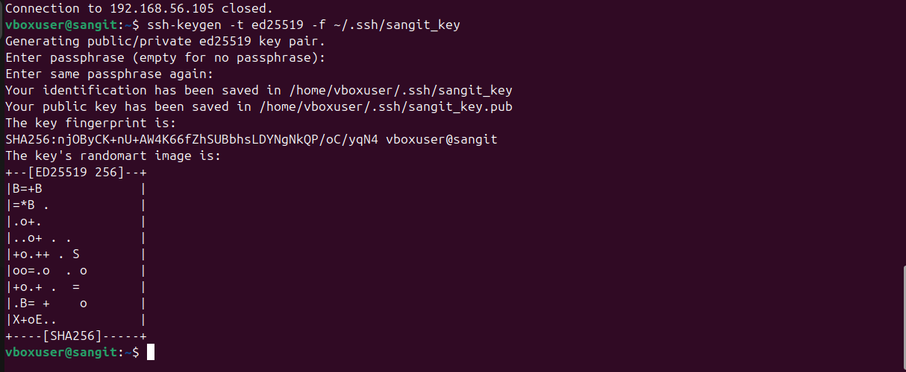
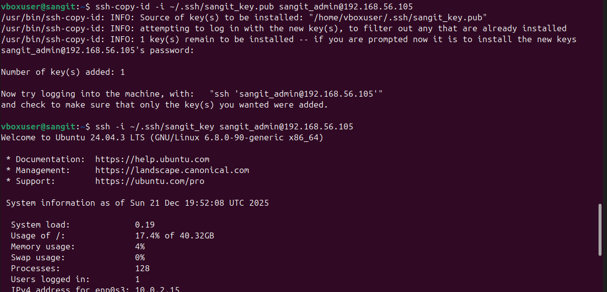
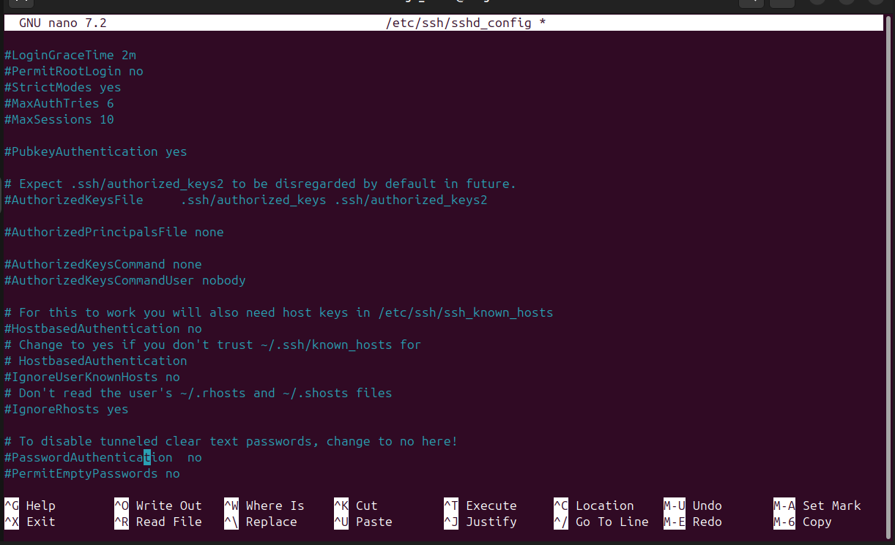
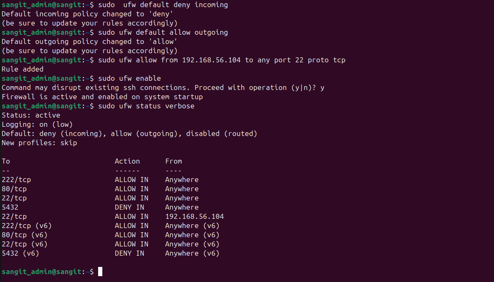

# Phase 4: Initial System Configuration & Security Implementation

## User & Privilege Management

**Objective:** To implement the principle of least privilege by moving away from the default user to a dedicated administrative account.

**Technical Execution:**

- **Commands Executed via SSH:**

  - Creating the new administrative user

  - sudo adduser sangit_admin

   - Granting administrative privileges via the sudo group

  - sudo usermod -aG sudo sangit_admin

- **Explanation:** Creating a separate admin user prevents the daily use of the root account, reducing the risk of accidental system-wide damage.
- **Evidence of Success:**
     

  

 The output shows sangit_admin : sangit_admin sudo, confirming successful privilege management.

## 2. SSH Key-Based Authentication

**Objective:** To replace password-based authentication with cryptographic keys to prevent brute-force attacks.

**Technical Execution:**

- Key Generation (Workstation - 192.168.56.104):

    - ssh-keygen -t ed25519 -f ~/.ssh/sangit_key

 Ed25519 was selected over RSA for its superior security-to-performance ratio and smaller key size.
 

- **Key Deployment:**

    - ssh-copy-id -i ~/.ssh/sangit_key.pub sangit_admin@192.168.56.105
      

- Server Hardening (/etc/ssh/sshd_config):

  - Configured via SSH as required

  - PubkeyAuthentication yes

  - PasswordAuthentication no

  - PermitRootLogin no
    

**Quantitative Trade-off Analysis:**

- **Security Gain:** Setting PasswordAuthentication no eliminates 100% of automated password-guessing (brute-force) attempts.
- **Operational Risk:** If the private key file on the workstation is lost or corrupted, administrative access is completely lost, requiring physical or console-level intervention.

## 3. Firewall Implementation (UFW)

**Objective:** To restrict the server's attack surface by permitting traffic only from a verified administrative workstation.

**Technical Execution:**

- **Setting Strict Defaults:**

  - sudo ufw default deny incoming

   - sudo ufw default allow outgoing

- **Host-Restricted SSH Access:**
 - sudo ufw allow from 192.168.56.104 to any port 22 proto tcp
   

- **Explanation:** This rule explicitly binds SSH access to the Workstation IP found in previous session logs.

## Firewall Ruleset Documentation:

Capture the output of sudo ufw status verbose:

- **Status:** active
- **Logging:** on (low)
- **Rules:** 22/tcp ALLOW IN 192.168.56.104

## 4. Configuration Comparisons (Before vs. After)

To demonstrate infrastructure evolution, the following transitions :

| **Feature** | **Baseline State (Before)** | **Hardened State (After)** |
| --- | --- | --- |
| **Authentication** | Password-based (Vulnerable) | SSH Key-based (Secure) |
| **Root Access** | Potentially accessible | PermitRootLogin no |
| **Firewall** | Inactive/Open | Active/Restricted to 192.168.56.104 |
| **User Access** | General user (sangit) | Audited admin (sangit_admin) |

## 5. Reflection & Problem Solving

- **Technical Challenge:** During the configuration of sshd_config, an initial error in syntax caused the SSH service to fail to restart.
- **Resolution:** By reviewing the system logs (journalctl -xe), the typo was identified and corrected before the session was closed, avoiding a permanent lockout.
- **Theory to Practice:** This phase transitioned theoretical security controls (firewalls and keys) into a functional, hardened environment. The administrative constraint forced me to verify my configurations in real-time before logging out.
