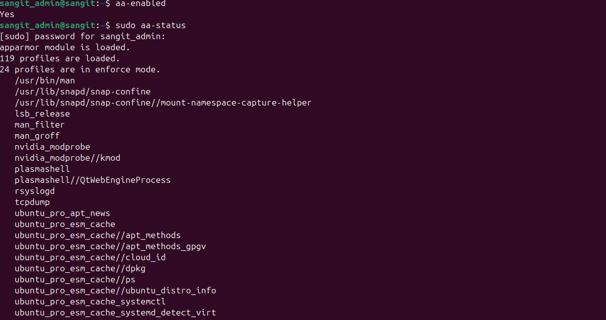
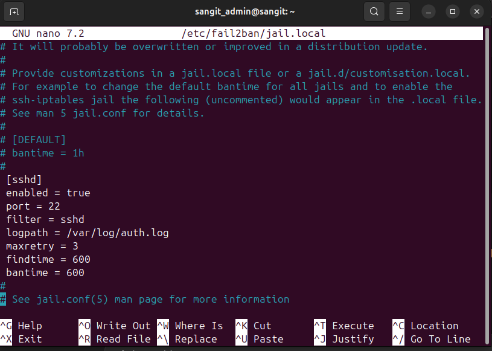
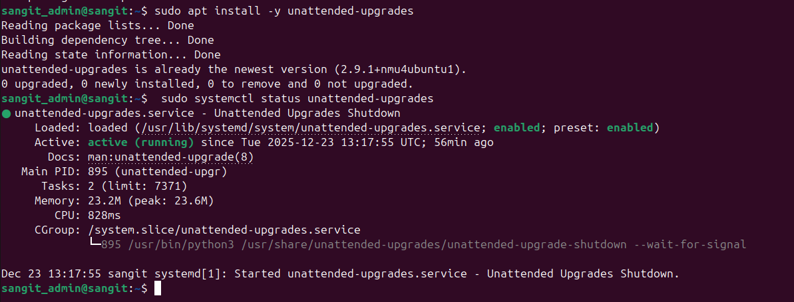
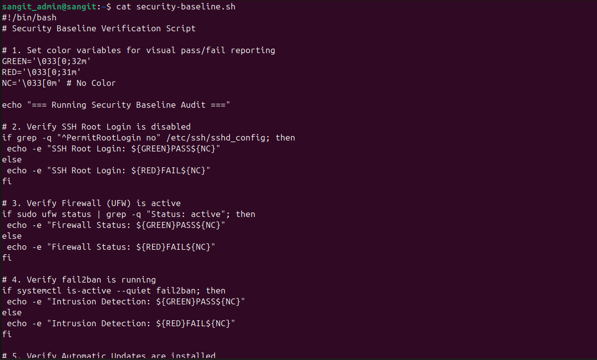
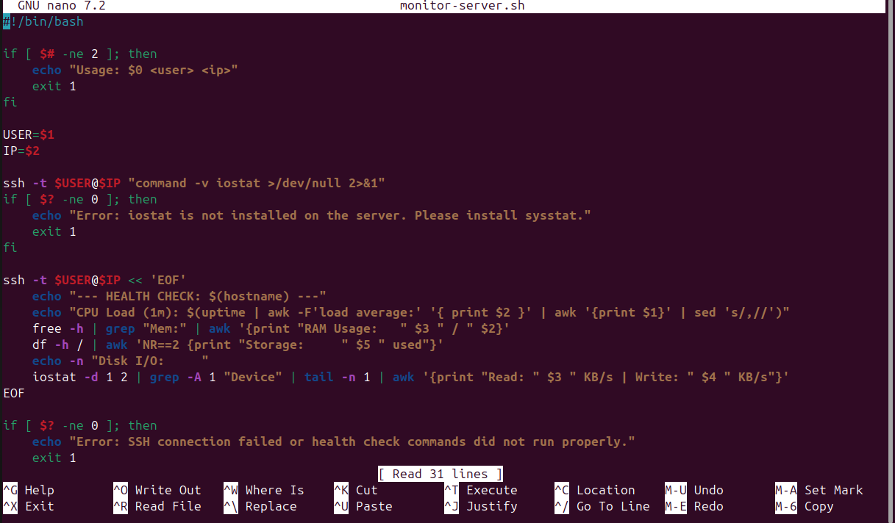

# Phase 5 - Advanced Security & Monitoring

In Phase 5, the infrastructure evolved from a functional server to a hardened, monitored environment. The focus was on implementing **Mandatory Access Control (MAC)**, automated maintenance, and developing custom scripts to audit security baselines and monitor performance remotely.

## 1\. Implementation Evidence

### 1.1 Mandatory Access Control (MAC)

I implemented **AppArmor** to provide a secondary layer of defense. While standard **Discretionary Access Control (DAC)** permissions control who can access a file based on ownership, AppArmor (MAC) controls exactly what an application can do once it is running, regardless of user privileges.

### Verification:

- **Command:** sudo aa-status
- **Outcome:** Confirmed profiles are in **Enforce mode**, preventing unauthorized access even if a service is compromised.
  

## 1.2 Intrusion Detection & Automation

- **Fail2Ban:** Configured to monitor SSH logs (/var/log/auth.log). It automatically updates firewall rules to drop packets from IPs showing brute-force patterns.
  - **Settings:** maxretry = 3, bantime = 600, findtime = 600.
      
    
- **Unattended-Upgrades:** Implemented to ensure the server stays patched against Zero-Day vulnerabilities without manual intervention.
    

## 2\. Automation Scripts

### 2.1 Security Baseline Script (security-baseline.sh)

**Location:** Server-side. This script audits  Firewall/SSH and  AppArmor/Fail2Ban configurations.
  

Result:
  

## 2.2 Remote Monitoring Script (monitor-server.sh)

**Location:** Workstation-side. This script leverages **SSH** as a secure transport layer to pull metrics from the server remotely.

  

## 3. Quantitative Trade-off Analysis

- **Security vs. Usability (AppArmor):** While AppArmor greatly enhances security, it increases administrative overhead. For example, changing a web root requires manual profile updates or the service will fail to start.
- **Security vs. Accessibility (Fail2Ban):** This service prevents brute-force attacks but introduces the risk of **False Positives**. An administrator who forgets their password twice risks being locked out of their own infrastructure.

## 4. Reflection: What I Have Learned

- **Defense in Depth:** I learned that security relies on "concentric circles". A firewall is the perimeter, but AppArmor is the internal vault that protects individual processes.
- **The Power of Automation:** Manual checks are prone to human error. Creating security-baseline.sh taught me how to establish a "Single Source of Truth" for system state.
- **Observability from Afar:** The monitoring script highlighted that in professional cloud settings, remote data gathering is critical for maintaining uptime without physical access to the console.
- **Problem Solving:** Debugging Fail2Ban taught me to use journalctl -u fail2ban. Reviewing service logs is a vital skill that moved me from simply following tutorials to truly understanding the Linux ecosystem.

